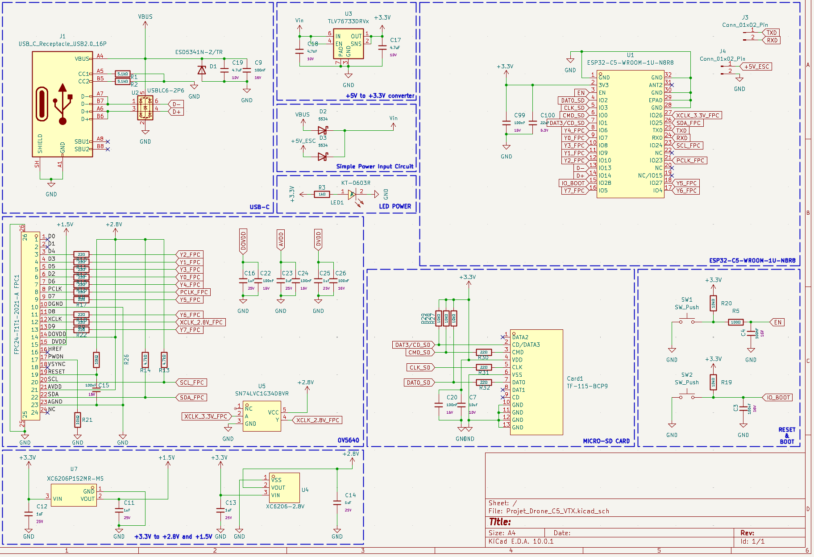
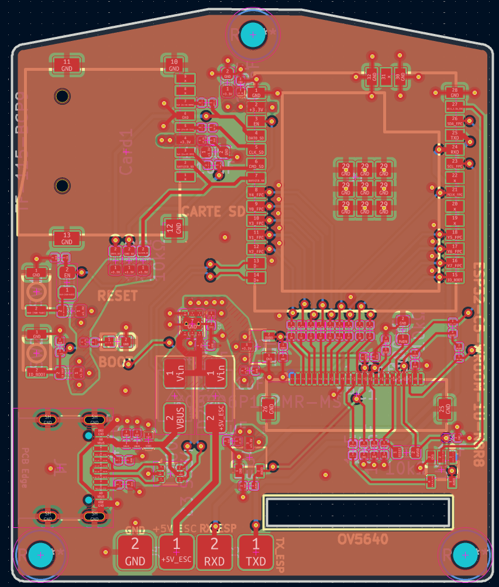
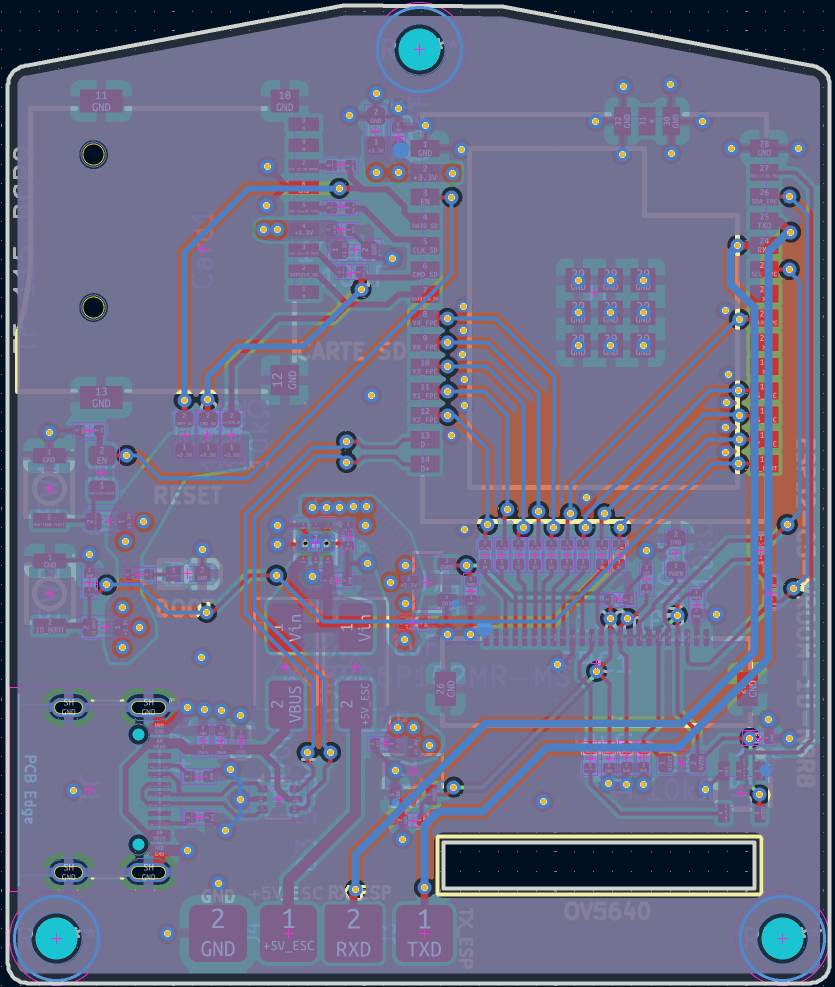
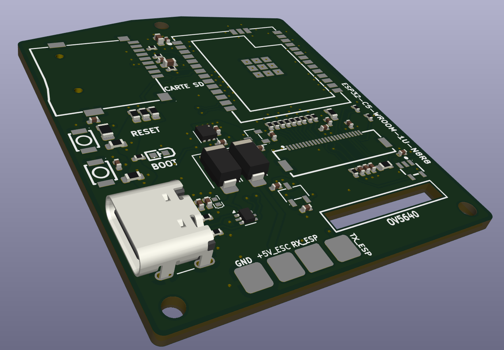

Ce PCB contient 4 couches, étant embarqué sur un drone, il possède des entrées d'alimentations +5V, que sont l'USB-C, également utilisé pour programmer l'ESP32, ainsi que des PADs de cuivre, qui viendront directement être branché à partir de mon flight controler. Il possède deux diodes Schottky pour faire du OR'ing. Une OV5640, un lecteur dde carte SD, ainsi qu'un module 1U spécialement choisi pour la possibilité d'y brancher une antenne, qui est une Lollipop en RHCP, mieux qu'une antenne "simple", car celle-ci émettra un signal en forme de cercle, parfaitement adapté pour une antenne en hauteur qui va communiquer avec le sol.

Je suis parti sur un 4 couches pour me simplifier la vie. Mon stack-up est le suivant : 

  - L1 : SIGNAL
  - L2 : GND
  - L3 : GND
  - L4 : SIGNAL/POWER

Tous les composants sont sur la même face pour des raisons économiques (plus cher de faire les deux face lors de l'assemblage chez JLCPCB). 

Afin d'optimiser l'intégrité des signaux, de nombreux vias de masse (ground vias) ont été placés pour relier (stitching) les plans de masse entre les couches L2 et L3. Ce stitching de masse assure un chemin de retour court, direct et ininterrompu pour les signaux numériques à haute vitesse (bus de la caméra OV5640, interface de la carte SD) ainsi que pour la section RF à 5.8 GHz. Cela permet de minimiser l'inductance des boucles de courant et de réduire drastiquement les interférences électromagnétiques (EMI), un point absolument critique dans l'environnement très bruyant d'un drone (ESC, moteurs). 

L'impédance de la ligne de communication différentiel D+/D- est matché à 90Ω

Voici la schématique : 

Voici le routage : 

Voici la 3D : 

