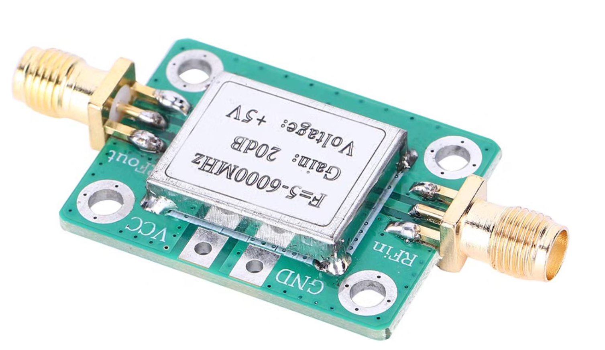

Pour pénétrer des environnements denses (bâtiments, forêts), l'amélioration envisagée est matérielle : ajouter un **amplificateur de signal (LNA/PA)** entre l'ESP32 et l'antenne Lollipop.

L'impact de l'augmentation des Watts : Augmenter la puissance TX (par exemple passer de 50 mW à 1 Watt) n'empêche pas le signal d'être bloqué par un obstacle, mais lui donne une "force de frappe" bien supérieure. Si un mur absorbe -15 dBm du signal, un signal partant à +30 dBm (1 Watt) traversera le mur en conservant +15 dBm de l'autre côté, permettant à la puce RTL8812Au de continuer à recevoir le flux vidéo sans coupure.

Voici un exemple d'amplificateur avec un gain de 20 dB, de 28mm x 23mm :

