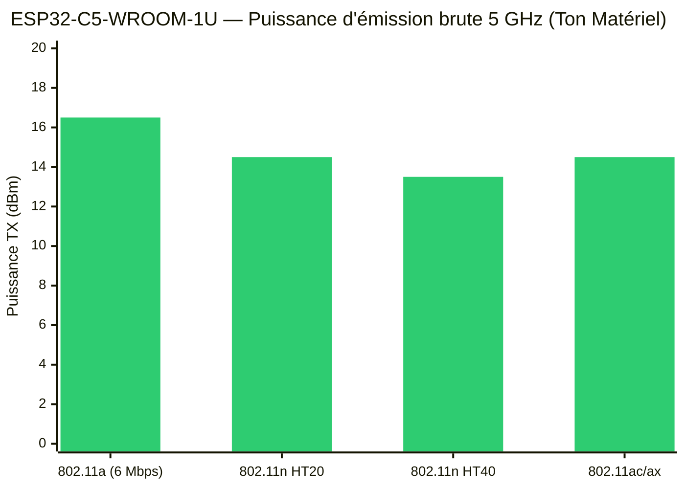
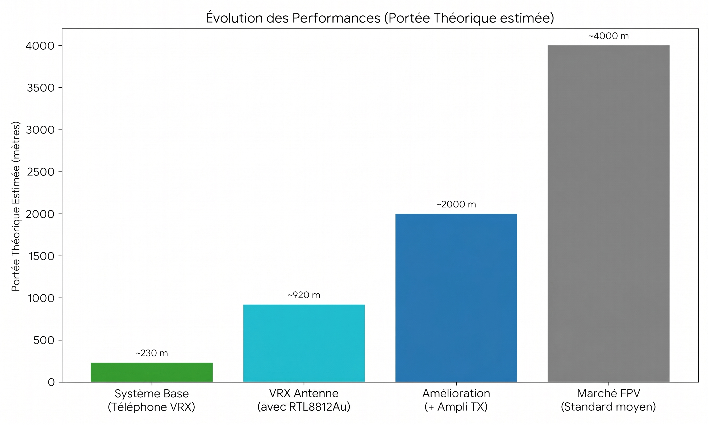

# 📡 Analyse de Performance du Système Wi-Fi FPV / Télémétrie

Ce document détaille les performances du système de transmission 100% numérique basé sur un ESP32-C5 (TX), ses différentes configurations de réception (RX), et l'analyse de son positionnement face au marché du FPV.

## 1. Architecture du Système : Émission (VTX)

Le système est **numérique**, reposant sur les protocoles Wi-Fi (802.11). Il force l'utilisation du **5 GHz sur le canal 36** (5170-5250 MHz), une bande explicitement autorisée par l'ARCEP pour les drones avec une limite de 200 mW EIRP (Equivalent Isotropic Radiated Power).

**Matériel TX (Drone) :**

* **Puce :** ESP32-C5 WROOM 1U (avec connecteur U.FL)
* **Antenne :** Lollipop 4 (Gain : 2.5 dBi, Polarisation : RHCP)

**Calcul de puissance (Bilan de liaison TX) :**
La puissance d'émission brute de la puce (selon le mode négocié) varie de 13.5 à 16.5 dBm (22 à 45 mW).
En y ajoutant le gain de 2.5 dBi de l'antenne Lollipop, le système émet avec une puissance EIRP comprise entre **16 dBm et 19 dBm (soit environ 40 à 80 mW EIRP)**.

*Conclusion : Le système exploite une excellente antenne émettrice tout en restant parfaitement dans le cadre réglementaire français (max 23 dBm / 200 mW).*

## 2. Évolution de la Réception (VRX) et Portée

Le véritable goulot d'étranglement de la version de base n'est pas le drone (VTX), mais la sensibilité de l'appareil qui reçoit le signal (VRX).

| Configuration Globale | Matériel VTX (Drone) | Matériel VRX (Réception) | Sensibilité RX | Portée Théorique (LOS) | Portée Réelle (Estimée) | 
| :--- | :--- | :--- | :--- | :--- | :--- | 
| **Système de Base (Actuel)** | ESP32-C5 + Lollipop 2.5 dBi | **Smartphone standard** | Mauvaise (Antennes internes) | \~ 230 m | **\~ 90 m** | 
| **Système Cible (Amélioré)** | ESP32-C5 + Lollipop 2.5 dBi | **VRX Antenne avec RTL8812Au (2x 5 dBi)** | Très haute (-90 dBm) | \~ 920 m | **\~ 360 m** | 

**Conclusion de l'amélioration RX :**
Remplacer le téléphone par la carte réseau avec puce RTL8812Au (et ses antennes externes 5 dBi) ajoute environ 12 dB au budget de liaison. En radiofréquence, un gain de 12 dB équivaut à **multiplier la portée par 4**. On gagne ainsi près de 690m de portée théorique sans rien modifier sur le drone.

  

La portée est donc certe divisée par 2, mais le prix l'est par 10, et surtout, qui a besoin de 4km de portée ? Pas moi en tout cas, et ca tomb bien, j'ai fait le projet pour moi :)

## 3. Piste d'Amélioration Future : Amplification du Signal (TX)

Pour pénétrer des environnements denses (bâtiments, forêts), l'amélioration envisagée est matérielle : ajouter un **amplificateur de signal (LNA/PA)** entre l'ESP32 et l'antenne Lollipop.

* **L'impact de l'augmentation des Watts :** Augmenter la puissance TX (par exemple passer de 50 mW à 1 Watt) n'empêche pas le signal d'être bloqué par un obstacle, mais lui donne une "force de frappe" bien supérieure. Si un mur absorbe -15 dBm du signal, un signal partant à +30 dBm (1 Watt) traversera le mur en conservant +15 dBm de l'autre côté, permettant à la puce RTL8812Au de continuer à recevoir le flux vidéo sans coupure.

* *Note : Cette modification fait sortir le système du cadre réglementaire des 200 mW (canal 36).*

## 4. Positionnement sur le Marché FPV (Coût VTX + VRX Complet)

La grande force de ce système est son coût global. Contrairement aux systèmes FPV du commerce où il faut acheter à la fois l'émetteur (Air Unit) ET le récepteur (Lunettes ou module), ici, le VRX est soit gratuit (téléphone), soit très abordable (Clé Wi-Fi Linux).

  

### Le Ratio Ultime : Portée Théorique gagnée par Euro investi

Si l'on croise le prix du système complet avec la portée théorique estimée, le projet sous RTL8812AU offre de loin la meilleure rentabilité du marché, battant même l'analogique d'entrée de gamme.

| Système | Portée Théorique | Prix Total (VTX+VRX) | Ratio (Mètres par Euro) | 
| :--- | :--- | :--- | :--- | 
| **Projet (Cible avec RTL8812Au)** | **\~ 920 m** | **50 €** | **18.4 m / €** 🏆 | 
| Marché Walksnail | \~ 4000 m | \~ 380 € | 10.5 m / € | 
| Marché Analogique | \~ 1000 m | \~ 100 € | 10.0 m / € | 
| **Projet (Base)** | **\~ 230 m** | **30 €** | **7.6 m / €** | 
| Marché DJI O3 | \~ 4000 m | \~ 800 € | 5.0 m / € | 

**Conclusion Générale :**
En investissant 20€ supplémentaires dans un système "VRX Antenne avec RTL8812Au" pour la réception, le système devient le plus compétitif du marché en termes de rapport portée/prix. Il surpasse les solutions analogiques d'entrée de gamme, tout en offrant une transmission 100% numérique à un coût total (54€) infiniment plus bas que les géants du secteur.
