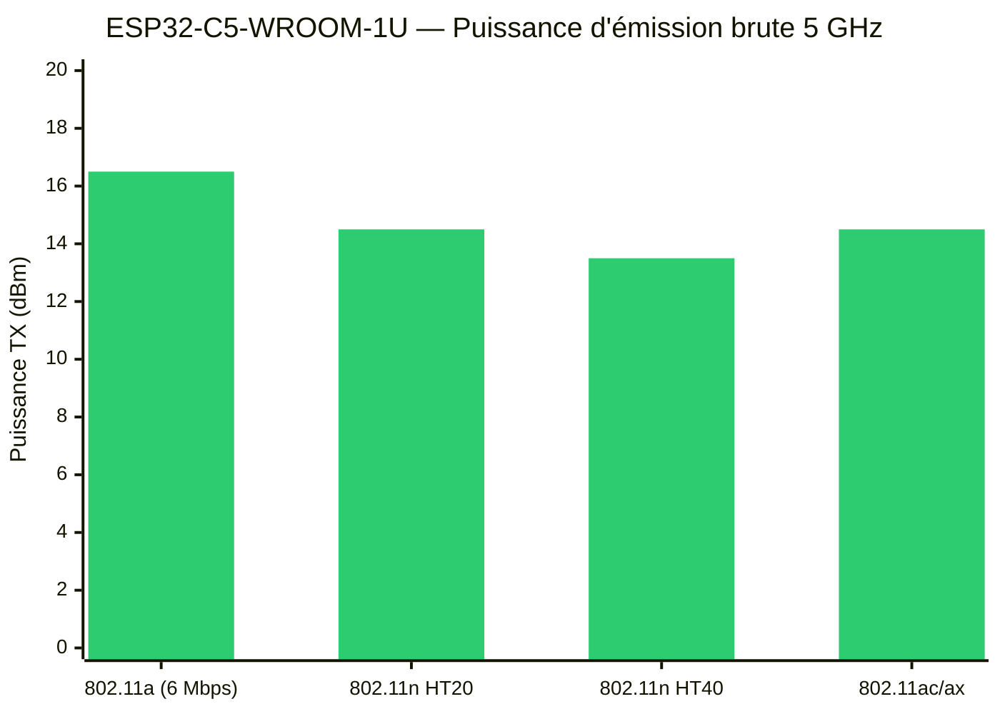
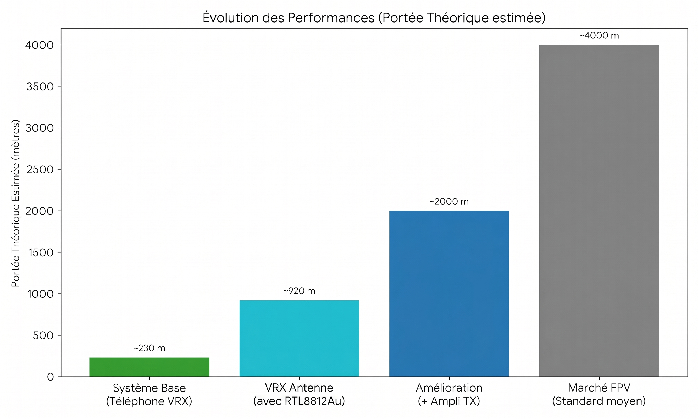

# Analyse de Performance du Système Wi-Fi FPV / Télémétrie 📡

Ce document détaille les performances d'un système de transmission 100 % numérique basé sur un ESP32-C5 (TX), ses configurations de réception (RX) et son positionnement face au marché du FPV.

## 0. Consommation et performances vidéo

Le système consomme 5 V × 0,3 A = **1,5 W**.

Performances vidéo (à compléter avec des mesures réelles) :

| Résolution | Qualité JPEG | Taille moyenne d'une image | Images/s | Débit vidéo | Latence (caméra → écran) |
| :--- | :--- | :--- | :--- | :--- | :--- |
| QVGA 320×240 | _à mesurer_ | _à mesurer_ | _à mesurer_ | _à mesurer_ | _à mesurer_ |
| SVGA 800×600 | _à mesurer_ | _à mesurer_ | _à mesurer_ | _à mesurer_ | _à mesurer_ |

> La latence se mesure en filmant un chronomètre affiché à l'écran à côté de la caméra : la différence entre le chronomètre réel et celui affiché donne la latence totale.

## 1. Architecture du Système : Émission (VTX)

Le système est **numérique** et repose sur le Wi-Fi (802.11). Il utilise le **5 GHz sur le canal 36** (5180 MHz, soit 5170-5190 MHz), dans la sous-bande 5170-5250 MHz. En France, la décision ARCEP n° 2022-1960 autorise cette sous-bande pour les aéronefs sans équipage, avec une limite de **200 mW p.i.r.e.** (23 dBm).

**Matériel TX (drone) :**

* **Puce :** ESP32-C5-WROOM-1U (connecteur U.FL)
* **Antenne :** Lollipop 4 (gain 2,5 dBi, polarisation RHCP)

**Bilan de puissance (TX) :**
La puissance d'émission de la puce varie de 13,5 à 16,5 dBm (22 à 45 mW) selon le mode négocié. Avec le gain de l'antenne (2,5 dBi), la puissance rayonnée est de **16 à 19 dBm p.i.r.e. (environ 40 à 80 mW)**, ce qui reste sous la limite réglementaire de 23 dBm.

Le graphique montre que le mode **802.11a à 6 Mbps** est celui qui donne la puissance maximale (16,5 dBm) : c'est donc aussi le mode le plus favorable à la portée.

```mermaid
%%{init: {'themeVariables': {'xyChart': {'plotColorPalette': '#2ecc71'}}}}%%
xychart-beta
    title "ESP32-C5-WROOM-1U — Puissance d'émission brute 5 GHz"
    x-axis ["802.11a (6 Mbps)", "802.11n HT20", "802.11n HT40", "802.11ac/ax"]
    y-axis "Puissance TX (dBm)" 0 --> 20
    bar [16.5, 14.5, 13.5, 14.5]
```

## 2. Évolution de la Réception (VRX) et Portée

Le goulot d'étranglement de la version de base n'est pas le drone, mais la sensibilité du récepteur.

**Hypothèses du calcul :**
* Débit physique bas (~6 Mbps), seul débit pour lequel la sensibilité de −90 dBm est atteinte.
* Visibilité directe (LOS), propagation en espace libre.
* Portée « réelle » estimée = portée théorique ÷ 2,5 environ (sol, multitrajets, orientation des antennes). Pour un gain donné, le facteur ×4 en espace libre tombe plutôt vers ×2,5 en environnement réel.

| Configuration | Matériel VTX | Matériel VRX | Sensibilité RX | Portée théorique (LOS) | Portée réelle estimée |
| :--- | :--- | :--- | :--- | :--- | :--- |
| **Base (actuelle)** | ESP32-C5 + Lollipop 2,5 dBi | **Smartphone** | Faible (antennes internes) | ~ 230 m | **~ 90 m** |
| **Cible (améliorée)** | ESP32-C5 + Lollipop 2,5 dBi | **RTL8812AU (2× 5 dBi)** | Élevée (−90 dBm) | ~ 920 m | **~ 360 m** |

Remplacer le téléphone par une carte RTL8812AU avec antennes externes de 5 dBi ajoute environ **12 dB** au bilan de liaison. En espace libre, 12 dB multiplient la portée par 4, sans toucher au drone.

  

**Limites à garder en tête :**

* **Le débit vidéo doit tenir dans le débit radio.** À 6 Mbps de débit physique, on dispose d'environ 4 à 5 Mbps utiles. Un JPEG SVGA de 30 Ko à 24 images/s représente déjà ~5,8 Mbps : il faut donc rester en résolution inférieure ou monter le débit radio, ce qui réduit la portée.
* **Polarisation.** L'antenne du drone est RHCP. Si les antennes de la clé RTL8812AU sont linéaires, la différence de polarisation coûte environ 3 dB (~30 % de portée). Pour profiter pleinement du gain, utiliser aussi des antennes RHCP en réception.

Je n'ai pas besoin de 4 km de portée : j'ai fait ce projet pour moi, et même divisée par 3, la portée réelle suffit largement pour mon application, comme pour la majorité des usages.

## 3. Pistes d'Amélioration Future : Amplification du Signal (TX)

Pour pénétrer des environnements denses (bâtiments, forêts), on peut ajouter un **amplificateur (PA/LNA)** entre l'ESP32 et l'antenne.

* **Version légale :** monter jusqu'à la limite de 23 dBm p.i.r.e. (200 mW) apporte environ **+4 à +7 dB** par rapport aux 16–19 dBm actuels, soit une portée théorique d'environ **1,7 km** (~ ×1,9).
* **Version 1 W (hors cadre) :** passer à 1 W apporte environ +12 dB (~ ×4, soit ~ 3,7 km théorique), mais sort du cadre réglementaire des 200 mW et demande plusieurs watts d'alimentation, contre 1,5 W pour le système actuel. Cette option n'est pas recommandée en France.
* **Effet sur les obstacles :** de la puissance en plus ne supprime pas l'atténuation d'un obstacle, mais laisse plus de marge. Si un mur atténue de 15 dB, un signal émis 12 dB plus fort arrive 12 dB plus fort de l'autre côté, ce qui peut suffire à maintenir la liaison.

## 4. Positionnement sur le Marché FPV (coût VTX + VRX)

La force du système est son coût global : contrairement aux systèmes du commerce où il faut acheter émetteur **et** récepteur (lunettes ou module), le VRX est ici soit gratuit (téléphone), soit très abordable (clé Wi-Fi sous Linux).

  

### Portée théorique par euro investi

Les portées des systèmes du commerce sont des chiffres constructeurs en conditions idéales : elles ne sont pas directement comparables à une portée mesurée en France. Ces systèmes offrent en outre une image HD et des fonctions (DVR, etc.) que ce projet n'a pas.

| Système | Portée théorique | Prix total (VTX+VRX) | Ratio (m / €) |
| :--- | :--- | :--- | :--- |
| **Projet (upgrade légal 200 mW)** | **~ 1700 m** | **75 €** | **22,7 m / €** 🏆 |
| **Projet (cible, RTL8812AU)** | **~ 920 m** | **50 €** | **18,4 m / €** |
| Walksnail | ~ 4000 m | ~ 380 € | 10,5 m / € |
| Analogique | ~ 1000 m | ~ 100 € | 10,0 m / € |
| **Projet (base, smartphone)** | **~ 230 m** | **30 €** | **7,7 m / €** |
| DJI O3 | ~ 4000 m | ~ 800 € | 5,0 m / € |

**Conclusion :** pour 20 € de plus (50 € au total), la clé RTL8812AU multiplie la portée par 4 sur le papier et offre le meilleur rapport portée théorique / prix du tableau, avec une transmission numérique. Ce n'est pas un concurrent direct des systèmes HD du commerce : c'est une solution très économique, adaptée à une portée de quelques centaines de mètres.

## 5. Prochaines étapes

* Mesurer la taille des images, le débit et la latence (section 0).
* Passer à une réception sous Linux avec la RTL8812AU en mode moniteur.
* Remplacer le serveur HTTP/TCP par de l'injection de trames 802.11 brutes (sans association ni retransmissions), avec fragmentation des JPEG.
* Tester le débit radio fixe bas et mesurer la portée réelle sur le terrain.
